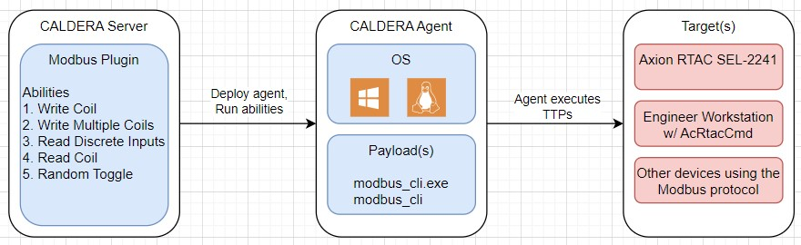

# Modbus

Modbus Protocol Threat Emulation Tooling

## Overview
The Modbus plugin provides adversary emulation abilities specific to the Modbus protocol. The specification for the Modbus protocol is free and available to download from the Modbus organization at [modbus.org](https:www.modbus.org/specs.php) The following table outlines MITRE ATT&CK for ICS Tactic coverage provided by the Modbus plugin.

|Collection                |Impact
|:-------------------------|:-
|Point & Tag Identification|Manipulation of Control

### Compatability
The plugin payload(s) currently support deployment to Caldera agents for the following computer architectures:
|      |Windows |Linux | Macintosh|
|-----:|:------:|:----:|:--------:|
|32-bit|        |      |          |
|64-bit|X       |X     |          |

* The linux payload was compiled with Ubuntu 22.04.2 LTS, Python version 3.8-dev, Pyinstaller 5.10.1.
* The windows payload was compiled with Windows 10 v21H2, Python version 3.8.10, Pyinstaller 5.10.1.

### Ability Overview Tables
The following tables list each plugin ability by their corresponding tactic. A heatmap of plugin abilities is available to view [here](assets/heatmap.jpg).

#### **Collection Abilities**
| Name 	                | Tactic 	        | Technique |  Technique ID     |
|----------             |---------          |-----------|----------         |
|[Modbus Read Coils](#read-coils)  |Collection  |Point & Tag Identification  |T0861  |
|[Modbus Read Discrete Inputs](#read-discrete-inputs)  |Collection  |Point & Tag Identification  |T0861  |
|[Modbus Read Holding Registers](#read-holding-registers)  |Collection  |Point & Tag Identification  |T0861  |
|[Modbus Read Input Registers](#read-input-registers)  |Collection  |Point & Tag Identification  |T0861  |

#### **Impact Abilities**
| Name 	                | Tactic 	        | Technique |  Technique ID     |
|----------             |---------          |-----------|----------         |
|[Modbus Write Single Coil](#write-single-coil)  |Impact  |Manipulation of Control  |T0831  |
|[Modbus Write Single Register](#write-single-register)  |Impact  |Manipulation of Control  |T0831  |
|[Modbus Write Multiple Coils](#write-multiple-coils) |Impact  |Manipulation of Control  |T0831  |
|[Modbus Write Multiple Registers](#write-multiple-registers)  |Impact  |Manipulation of Control  |T0831  |
|[Modbus Fuzz Coils](#fuzz-coils)  |Impact  |Manipulation of Control  |T0831  |
|[Modbus Fuzz Registers](#fuzz-registers)  |Impact  |Manipulation of Control  |T0831  |

## Architecture

This section describes the main components of the plugin and how they interface.
### Block Diagram

The Modbus Plugin allows a user to execute several abilities once added to the Caldera instance. The abilities will be executed via the Caldera agent and corresponding payload. This is intended to target devices communicating via the Modbus protocol, likely over port 502.

### Payloads

The Modbus Plugin includes 2 payloads that implement the abilities, each is described below.

Payload:
* `modbus_cli | modbus_cli.exe`: &emsp; CLI enabling all the Modbus threat emulation actions.

### Libraries
The following libraries were used to build the Modbus payloads:
| Library | Version	 | License |
|---------|--------- |---------|
|pymodbus |[2.5.3](https://github.com/pymodbus-dev/pymodbus/tree/v2.5.3) |[BSD](https://github.com/pymodbus-dev/pymodbus/blob/v2.5.3/LICENSE)      |
|pyserial |[3.5](https://github.com/pyserial/pyserial/tree/v3.5)    |[BSD](https://github.com/pyserial/pyserial/blob/v3.5/LICENSE.txt)      |
|six      |[1.16.0](https://github.com/benjaminp/six/tree/1.16.0)    |[MIT](https://github.com/benjaminp/six/blob/1.16.0/LICENSE)|

## Usage
This section describes how to initially deploy and execute the abilities present within the Modbus plugin.

### Deployment
1. Identify the target system you would like to communicate with via the Modbus protocol.
2. Identify a viable host for the Caldera agent that will be sending Modbus messages to the target system.
3. Deploy the Caldera agent to the viable host.
4. Run any of the Modbus plugin abilities listed below to achieve desired impact.

*Reference the Caldera training plugin for a step-by-step tutorial on how to deploy an agent and run abilities via a campaign.*

#### Modbus Sources and Facts

The following Facts are used by Modbus plugin abilities:

Key:
- [-] = Ability does not use this fact
- [**X**] = Ability uses this fact

| Fact Name/Ability Used By | Read Coil	 | Read Discrete Input | Read Input Register | Read Holding Register |
|---------                  |---------   |---------	           |---------	         |---------              |
| modbus.all.deviceip       | [**X**]    | [**X**]             |[**X**]              | [**X**]               |
| modbus.all.deviceport     | [**X**]    | [**X**]             |[**X**]              | [**X**]               |
| modbus.read_c.start       | [**X**]    | [-]                 |[-]                  | [-]                   |
| modbus.read_c.count       | [**X**]    | [-]                 |[-]                  | [-]                   |
| modbus.read_di.start      | [-]        | [**X**]             |[-]                  | [-]                   |
| modbus.read_di.count      | [-]        | [**X**]             |[-]                  | [-]                   |
| modbus.read_ir.start      | [-]        | [-]                 |[**X**]              | [-]                   |
| modbus.read_ir.count      | [-]        | [-]                 |[**X**]              | [-]                   |
| modbus.read_hr.start      | [-]        | [-]                 |[-]                  | [**X**]               |
| modbus.read_hr.count      | [-]        | [-]                 |[-]                  | [**X**]               |

| Fact Name/Ability Used By | Write Coil | Write Register | Write Multiple Coils | Write Multiple Registers |
|---------                  |---------   |---------	      |---------	         |---------                 |
| modbus.all.deviceip       | [**X**]    | [**X**]        |[**X**]               | [**X**]                  |
| modbus.all.deviceport     | [**X**]    | [**X**]        |[**X**]               | [**X**]                  |
| modbus.write_c.start      | [**X**]    | [-]            |[-]                   | [-]                      |
| modbus.write_c.value      | [**X**]    | [-]            |[-]                   | [-]                      |
| modbus.read_di.start      | [-]        | [**X**]        |[-]                   | [-]                      |
| modbus.read_di.count      | [-]        | [**X**]        |[-]                   | [-]                      |
| modbus.read_ir.start      | [-]        | [-]            |[**X**]               | [-]                      |
| modbus.read_ir.count      | [-]        | [-]            |[**X**]               | [-]                      |
| modbus.read_hr.start      | [-]        | [-]            |[-]                   | [**X**]                  |
| modbus.read_hr.count      | [-]        | [-]            |[-]                   | [**X**]                  |

| Fact Name/Ability Used By | Fuzz Coils | Fuzz Registers|
|---------                  |---------   |---------	     |
| modbus.all.deviceip       | [**X**]    | [**X**]       |
| modbus.all.deviceport     | [**X**]    | [**X**]       |
| modbus.fuzzcoil.start     | [**X**]    | [-]           |
| modbus.fuzzcoil.end       | [**X**]    | [-]           |
| modbus.fuzzcoil.count     | [**X**]    | [-]           |
| modbus.fuzzcoil.wait      | [**X**]    | [-]           |
| modbus.fuzzreg.start      | [-]        | [**X**]       |
| modbus.fuzzreg.end        | [-]        | [**X**]       |
| modbus.fuzzreg.count      | [-]        | [**X**]       |
| modbus.fuzzreg.min        | [-]        | [**X**]       |
| modbus.fuzzreg.max        | [-]        | [**X**]       |
| modbus.fuzzreg.wait       | [-]        | [**X**]       |

####  Sample Facts - Modbus
    ...
    name: Modbus Sample Facts
    facts:
    - trait: modbus.all.deviceip
      value: 192.168.0.1
    - trait: modbus.all.deviceport
      value: 5020
	- trait: modbus.fuzzcoil.start
	  value: 10
	- trait: modbus.fuzzcoil.end
	  value: 15
	- trait: modbus.fuzzcoil.count
	  value: 100
	- trait: modbus.fuzzcoil.wait
	  value: 1
    ...

Read more about [facts](https://caldera.readthedocs.io/en/latest/Basic-Usage.html?highlight=fact#facts) in the Caldera documentation.

### Abilities
#### Read Coils
	Modbus Function 1 (0x01): Read Coils

    This function code is used to read from 1 to 2000 contiguous states of coils in a
	remote device.

	Usage:
      ./modbus_cli <ip> -p <port> read_c <start> <count> -U <unit>

    Arguments:
      ip              target device IP address
      start           starting address to read from
      count           number of items to read

	Options:
      -p, --port      target device port (default: 502)
      -U, --unit      reference a specific unit over a serial connection (0-255)

	Example:
	  ./modbus_cli 10.0.0.100 read_c 3 1

#### Read Discrete Inputs
	Modbus Function 2 (0x02): Read Discrete Inputs

    This function code is used to read from 1 to 2000 contiguous discrete inputs
	in a remote device.

	Usage:
	./modbus_cli <ip> -p <port> read_di <start> <count> -U <unit>

	Arguments:
      ip              target device IP address
      start           starting address to read from
      count           number of items to read

	Options:
      -p, --port    target device port (default: 502)
	  -U, --unit    reference a specific unit over a serial connection (0-255)

	Example:
	  ./modbus_cli 127.0.0.1 -p 5020 read_di 1 8

#### Read Holding Registers
	Modbus Function 3 (0x03): Read Holding Registers

    This function code is used to read the contents of a contiguous block of holding
	registers in a remote device.

	Usage:
      ./modbus_cli <ip> -p <port> read_hr <start> <count> -U <unit>

    Arguments:
      ip              target device IP address
      start           starting address to read from
      count           number of items to read

	Options:
      -p, --port      target device port (default: 502)
      -U, --unit      reference a specific unit over a serial connection (0-255)

	Example:
	  ./modbus_cli 192.168.0.20 read_hr 3 1

#### Read Input Registers
	Modbus Function 4 (0x04): Read Input Registers

    This function code is used to read from 1 to 125 contiguous input registers in a
	remote device.

	Usage:
      ./modbus_cli <ip> -p <port> read_ir <start> <count> -U <unit>

    Arguments:
      ip              target device IP address
      start           starting address to read from
      count           number of items to read

	Options:
      -p, --port      target device port (default: 502)
      -U, --unit      reference a specific unit over a serial connection (0-255)

	Example:
	  ./modbus_cli 127.0.0.1 -p 111 read_ir -U 1 1 10

#### Write Single Coil
	Modbus Function 5 (0x05): Write Single Coil

    This function code is used to write a single output to either ON or OFF in a
	remote device.

	Usage:
	./modbus_cli <ip> -p <port> write_c <start> <value> -U <unit>

	Arguments:
	  ip              target device IP address
	  start           starting address to write to
	  value           value to write (0,1)

	Options:
      -p, --port      target device port (default: 502)
	  -U, --unit      reference a specific unit over a serial connection (0-255)

	Example:
	  ./modbus_cli 192.168.1.1 -p 5020 write_c 0 1

#### Write Single Register
	Modbus Function 6 (0x06): Write Single Register

    This function code is used to write a single holding register in a remote device.

	Usage:
	./modbus_cli <ip> -p <port> write_r <start> <value> -U <unit>

	Arguments:
      ip              target device IP address
      start           starting address to read from
      value           value to write (0-65535)

	Options:
      -p, --port      target device port (default: 502)
      -U, --unit      reference a specific unit over a serial connection (0-255)

	Example:
	  ./modbus_cli 192.168.1.1 -p 5020 write_r 10 5000

#### Write Multiple Coils
	Modbus Function 15 (0x0F): Write Multiple Coils

    This function code is used to force each coil in a sequence of coils to either
	ON or OFF in a remote device.

	Usage:
	./modbus_cli <ip> -p <port> write_multi_c <start> <value> <count> -U <unit>

	Arguments:
	  ip              target device IP address
	  start           starting address to write to
	  value           value to write (0,1)
	  count           number of coils to be written to

	Options:
      -p, --port      target device port (default: 502)
	  -U, --unit      reference a specific unit over a serial connection (0-255)

	Example:
	  ./modbus_cli 192.168.1.1 -p 5020 write_multi_c 0 1 5

#### Write Multiple Registers
	Modbus Function 16 (0x10): Write Multiple Registers

    This function code is used to write a block of contiguous registers
	(1 to 123 registers) in a remote device.

	Usage:
	./modbus_cli <ip> -p <port> write_multi_r <start> <value> <count> -U <unit>

	Arguments:
	  ip              target device IP address
	  start           starting address to write to
	  value           value to write (0-65535)
	  count           number of registers to write to

	Options:
      -p, --port      target device port (default: 502)
	  -U, --unit      reference a specific unit over a serial connection (0-255)

	Example:
	  ./modbus_cli 192.168.1.1 -p 5020 write_multi_r 10 33 5

#### Fuzz Coils
	Procedure
    Modbus Function 5 (0x05) Write Single Coil

    Writes random values to random coils over specified ranges.

	Usage:
	./modbus_cli <ip> -p <port> fuzz_c <start> <end> <count> --wait <wait> -U <unit>

	Arguments:
	  ip              target device IP address
      start           start range of coils (inclusive)
      end             end range of coils (inclusive)
      count           number of coils in the provided range to perform the write on

	Options:
      -p, --port      target device port (default: 502)
	  -U, --unit      reference a specific unit over a serial connection (0-255)
	  --wait          seconds to wait in between write operations

	Example:
	  ./modbus_cli 192.168.1.1 -p 5020 fuzz_c 1 10 5 --wait 1

#### Fuzz Registers
	Procedure
    Modbus Function 6 (0x06): Write Single Register

    Writes random values to random registers over specified ranges.

	Usage:
	./modbus_cli <ip> -p <port> fuzz_r <start> <end> <count> --min <min> --max <max> --wait <wait> -U <unit>

	Arguments:
	  ip              target device IP address
      start           start range of coils (inclusive)
      end             end range of coils (inclusive)
      count           number of registers in the provided range to perform the write on

	Options:
      -p, --port      target device port (default: 502)
	  -U, --unit      reference a specific unit over a serial connection (0-255)
	  --min           lower limit for random register value (inclusive)
	  --max           upper limit for random register value (inclusive)
	  --wait          seconds to wait in between write operations

	Example:
	  ./modbus_cli 192.168.1.1 -p 5020 fuzz_r 1 10 5 --min 0 --max 100 --wait 1

## Source Code
The source code for the Modbus plugin can be found inside this plugin's [src directory](/src/).

## Copyright Notice
Modbus® is a registered trademark of SCHNEIDER ELECTRIC USA, INC. CORPORATION DELAWARE 1415 SOUTH ROSELLE ROAD PALATINE ILLINOIS 60067

This Caldera plugin is named "Modbus" as that is a short identifier of its purpose / scope. This plugin is not produced-by Schneider Electric or The Modbus Corporation.